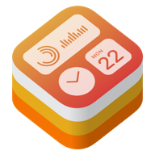

#  Awesome iOS Widgets 

A curated list of home screen widgets for apps on iOS 14!

## Contents

- [How to use Widgets](#how-to-use-widgets)
- [Apps](#apps)
  - [Included with iOS 14](#included-with-ios-14)
  - [Gaming](#gaming)
    - [Utilities](#gaming-utilities)
  - [Music](#music)
  - [News](#news)
  - [Social Networking](#social-networking)
  - [Sports](#sports)
  - [Weather](#weather)

## How to use Widgets

Widgets are downloaded alongside supported apps from the App Store. They require iOS 14 to be installed on your iPhone or iPad to use. To add one to your Home Screen, touch and hold anywhere on the Home Screen. Once the app icons start jiggling, you should notice a button with a plus sign (+) in the corner of the screen. Tap that button to pull up the list of apps with widgets you can add.

Each app can have multiple widgets for different tasks, and each widget can have multiple sizes for small, medium, and large. Not all widgets will include all sizes, however. When you find a widget you want to add in the size you want, tap "Add Widget" to add it to your Home Screen. You can then move it around like any app icon, or tap it to open into the relevant app. You can also add the Smart Stack, which lets you put multiple widgets in one space, and the Smart Stack will rotate between them automatically based on context.

You can include multiple copies of a single widget, at the same or different sizes, to different home screens. This can be useful for widgets that show one piece of information, such as the price of a given stock. Widgets can also have individual settings, such as which stock symbol to show. Tap a widget when editing the Home Screen, and if it supports settings, it will flip around to let you change them.

## Apps

### Included with iOS 14

- **Smart Stack** - Automatically rotates widgets to show the most relevant information throughout the day and can also be flipped through easily. `Free` `Small` `Medium` `Large`
- **Batteries** - Free. View the status of your iPhone and connected Bluetooth accessories. `Free` `Small` `Medium` `Large`
- **Calendar** - Keep track of your upcoming events and meetings. `Free` `Small` `Medium` `Large`
- **Clock** `Free`
  - **City** -  Add a clock for a city to check the time at that location. `Small`
  - **World Clock** - View the time in multiple cities around the world. `Small` `Medium`
- **Files** - Quickly acces files you've recently opened. `Free` `Medium` `Large`
- **Fitness** - Check in on your movement throughout the day. `Free` `Small` `Medium`
- **Maps** - Get suggested destinations and track your ETA during navigation. `Free` `Small` `Medium` `Large`
- **Music** - Quickly access recently played albums or playlists. `Free` `Small` `Medium` `Large`
- **News** `Free`
  - **Topic** - Get stories about a topic you're interested in. `Small` `Medium` `Large`
  - **Today** - Get today's news, including top stories. `Small` `Medium` `Large`
- **Notes** `Free`
  - **Folder** - Get quick access to one of your Notes folders. `Small` `Medium` `Large`
  - **Note** - Get quick access to one of your notes. `Small`
- **Photos** - Appreciate special moments through Memories and Featured Photos. `Free` `Small` `Medium` `Large`
- **Podcasts** - Keep listening where you left off or see what's next. `Free` `Small` `Medium` `Large`
- **Reminders** - Get quick access to one of your reminder lists. `Free` `Small` `Medium` `Large`
- **Screen Time** - Check in on your screen time activity for the day. `Free` `Small` `Medium` `Large`
- **Shortcuts** - Quickly run your shortcuts. `Free` `Small` `Medium` `Large`
- **Siri Shortcuts** `Free`
  - **App Suggestions** - Get app launch suggestions based on your usage patterns. `Medium`
  - **Shortcut Suggestions** - See relevant shortcut actions based on your usage patterns. `Small` `Medium` `Large`
- **Stocks** `Free`
  - **Watchlist** - View price quotes and track performance of your watchlist throughout the day. `Small` `Medium` `Large`
  - **Symbol** - View price quotes and track performance of a symbol throughout the day. `Small`
- **TV** - Keep watching where you left off or see what's on next. `Free` `Small` `Medium` `Large`
- **Tips** - Get the most from your Apple devices with helpful hints and hidden gems. `Free` `Small` `Medium` `Large`
- **Weather** - See the current weather conditions and forecast for a location. `Free` `Small` `Medium` `Large`

## Gaming

### Gaming Utilities

- **[GameTrack](https://apps.apple.com/gb/app/gametrack/id1136800740)** `Free w/ $0.99-$7.99 subscription`
  - **Now Playing** - View the games you've set to Now Playing. ([Preview](https://twitter.com/getgametrack/status/1306336127436161024)) `Small` `Medium` `Large`
  - **Upcoming** - View the upcoming ames from your wish lists. ([Preview](https://twitter.com/getgametrack/status/1306336127436161024)) `Small` `Medium` `Large`

## Music

- **[Next: Magic DJs & Playlists](https://apps.apple.com/us/app/id622463230)** `$4.99`
  - **Most Played** - Jump into your favorite Magic DJs and playlists. ([Preview](https://www.instagram.com/p/CFAYMqHJHJv/))
  - **Recently Played** - Jump into your most recent Magic DJs and playlists. ([Preview](https://www.instagram.com/p/CFAYMqHJHJv/))
- **[Soor](https://apps.apple.com/app/id1439731526)** `$4.99`
  - **Now Playing** - Shows the current song and what's up next. ([Preview](Screenshots/Soor/widgets.png)) `Small` `Medium` `Large`
  - **Music Collection** - Shows different types of content.  ([Preview](Screenshots/Soor/widgets.png))
  - **Magic Mixes** - Shows your mixes. ([Preview](Screenshots/Soor/widgets.png))

## News
- **[Brief: just the news you need](https://apps.apple.com/us/app/brief-just-the-news-you-need/id1475186118) `Free, $4.99/month subscription`
  - **Front Page** - A curated feed of the most important news stories of the day.
  - **Election Snapshot** - Keep track of the current presidential, house, and senate races.

## Social Networking

- **[Apollo](https://itunes.apple.com/app/id979274575)** `Free, $0.99/month subscription`
  - **Post** - Shows a post from a Reddit feed of your choosing. ([Preview](https://twitter.com/ChristianSelig/status/1306344121947299840)) `Small` `Medium` `Large`
  - **Multiple Posts** - Shows an overview of multiple posts from your favorite Reddit feed. ([Preview](https://twitter.com/ChristianSelig/status/1306344121947299840)) `Small` `Medium` `Large`
  - **Post Feed Grid** - Shows multiple posts in a grid from a feed of your choosing. ([Preview](https://twitter.com/ChristianSelig/status/1306344121947299840)) `Small` `Medium` `Large`
  - **Wallpaper** - Rotates through beautiful photos from image-heavy subreddits of your choosing. ([Preview](https://twitter.com/ChristianSelig/status/1306344121947299840)) `Small` `Medium` `Large`
  - **Subreddit Shortcuts** - Quickly jump to your favorite subreddits. ([Preview](https://twitter.com/ChristianSelig/status/1306344121947299840)) `Small` `Medium` `Large`
  - **Showerthoughts** - Cycles through popular posts from the Showerthoughts subreddit. ([Preview](https://twitter.com/ChristianSelig/status/1306344121947299840)) `Small`
  - **Jokes** - Shows jokes from joke-related subreddit to brighten your day. ([Preview](https://twitter.com/ChristianSelig/status/1306344121947299840)) `Medium`

## Sports

- **[Pennant](https://apps.apple.com/us/app/id622463230)** `Free w/ $1.99-$4.99 subscription`
  - **League Standings** - Current standings for a given league. ([Preview](https://twitter.com/PennantApp/status/1306332494434893825))
  - **Division Standings** - Current standings for a given division. ([Preview](https://twitter.com/PennantApp/status/1306332494434893825))
  - **Team Standings** - Current standings for a given team.  ([Preview](https://twitter.com/PennantApp/status/1306332494434893825))
  - **Team Splits** - Standings for a given team, split by hoem/away and division. ([Preview](https://twitter.com/PennantApp/status/1306332494434893825))
  - **Game Margin** - Shows how a team is performing over time. ([Preview](https://twitter.com/PennantApp/status/1306332800967225345))
  - **Last Ten Games** - Results of the last ten games. ([Preview](https://twitter.com/PennantApp/status/1306332800967225345))

## Weather

- **[CARROT Weather](https://apps.apple.com/app/id961390574)** `$4.99 + Monthly/Yearly Subscriptions`
  - **Snark** - Puts CARROT's trademark banter front and center. ([Preview](https://twitter.com/CARROT_app/status/1306332591654662146/photo/2))
  - **Forecast** - Gives a detailed look at short-term, hourly, and daily weather. ([Preview](https://twitter.com/CARROT_app/status/1306332591654662146/photo/2))
  - **Hourly/Daily** - Focuses exclusively on hourly and daily forecasts. ([Preview](https://twitter.com/CARROT_app/status/1306332591654662146/photo/2)) `Subscription required`
  - **Weather Maps** - Lets you keep an eye on storms bearing down on your location. ([Preview](https://twitter.com/CARROT_app/status/1306332591654662146/photo/2)) `Subscription required`
- **[Weather Line]()** - The all-in-one widget dynamically adapts to show you what's most important *right now* – extreme weather, minutely rain graph, AQI, and weather warnings, with 20 themes to choose from. ([Preview](Screenshots/Weather%20Line/widgets.png)) `Free w/ Subscription` `Small` `Medium` `Large`

# Contribute

Contributions welcome! Read the [contribution guidelines](contributing.md) first.
